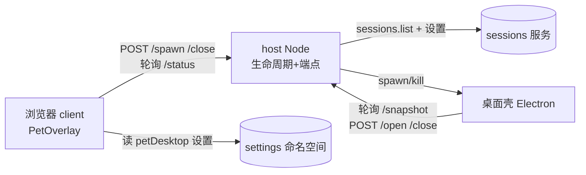

# dsh-session-desk 桌面宠物 设计（Electron 透明置顶窗 + 桌面/浏览器模式）

**日期**：2026-08-21
**状态**：待审阅
**范围**：为已上线的 `dsh-session-desk` 新增「桌面宠物」——让宠物脱离浏览器，以无边框、透明、always-on-top 的桌面小窗常驻，支持三平台（Windows / macOS / Linux）。

---

## 0. 已拍板决定

| 题 | 决定 |
|---|---|
| 桌面窗口技术 | Electron（无边框 + 透明 + always-on-top + 透明区鼠标穿透），复用现有 webm 动画与 React 组件 |
| Electron 分发 | **按需下载**：首次启用时按平台下载官方 Electron（约 150MB）缓存到用户目录，之后离线复用，版本锁定 |
| 平台范围 | 三平台一起设计（Windows / macOS / Linux），实现按平台验证 |
| 模式切换 | 宠物上两级「选择」：**「桌面」**= 常驻桌面最上层、不被遮挡（浏览器隐藏）；**「浏览器」**= 只在浏览器显示（桌面窗关闭）。两侧宠物都能切 |
| 模式持久化 | 新增 `petDesktop`（布尔，默认 `false`）。`true`=桌面为主场，`false`=浏览器为主场；持久化，记住上次选择，启动时按值自动拉起/收起桌面窗 |
| 状态同步 | 桌面壳与浏览器都**轮询 host 本地 HTTP**（1s 起步），不引入 WebSocket |
| 会话数据源 | host 复用 `webHost.sessions.list()`（`listedSessions` 同源），桌面宠物拿到与浏览器完全相同的会话状态 |

---

## 1. 背景与非目标

宠物当前是浏览器内的一个 React DOM 元素（`PetOverlay`），随浏览器最小化/切换而不可见。用户希望它常驻桌面，随时可见。

**非目标**

- 不做系统托盘 / 菜单栏图标形态（v1 只做透明置顶窗）。
- 不把「桌面点会话 → 浏览器聚焦」做到强可靠（浏览器跨平台聚焦无可靠 API，v1 只做会话切换 + best-effort 聚焦）。
- 不引入 WebSocket / 长连接，轮询够用。
- 不改宿主 DSH 源码，不依赖 `dsh-better-sidebar`。
- 桌面窗关闭即回浏览器，不做「最小化到托盘」等第三种状态。

---

## 2. 架构总览

三部分组成，共享一组 host 本地 HTTP 端点（挂在现有 `webHost.webServer`，`/session-desk/pet-desktop/` 前缀）：

- **host**：Electron 下载与进程生命周期；暴露 snapshot / status / spawn / close / open 端点。
- **桌面壳（Electron）**：透明置顶窗，复用 `PetOverlay`，轮询 snapshot 渲染，回发 open/close。
- **浏览器 client**：宠物上加「全局/关闭」选择；轮询 status 决定隐藏/显示。

---

## 3. 子系统 A：host 桌面管理

### 3.1 Electron 按需下载（新 `src/desktop/electron.ts`）

- `detectTarget()`：由 `process.platform` + `process.arch` 映射到 macOS / Windows / Linux 三档官方 zip 下载地址；版本常量锁定。
- `ensureElectron()`：目标目录 `~/.dsh-session-desk/electron/<version>/` 已存在可执行文件则直接复用；否则下载 zip → 解压 → 校验可执行文件存在 → 返回可执行文件路径。
- 下载失败返回明确错误（网络 / 磁盘 / 平台不支持），供端点以 `{ error }` 反馈前端提示。
- 幂等：并发调用去重（同一进程内只跑一次下载）。

### 3.2 进程生命周期（新 `src/desktop/lifecycle.ts`）

- `spawn()`：先 `ensureElectron()`，再以该可执行文件 spawn 桌面壳入口（`desktop-shell/main.mjs`），CLI 参数传入：host 的本地 base URL、一次性 token、宠物资源 URL。记录子进程句柄与 `active=true`。
- `close()`：向子进程发关闭信号 / `kill`，`active=false`，清理句柄。
- host 卸载 / 进程退出时同步 `close()`（复用现有 disposer 返回）。
- `active` 为运行时唯一真相来源；浏览器据此隐藏/显示。

### 3.3 本地 HTTP 端点（新 `src/desktop/http.ts`，前缀 `/session-desk/pet-desktop/`）

| 方法 | 路径 | 说明 |
|---|---|---|
| `GET` | `/status` | `{ active: boolean }`，浏览器隐藏/显示依据 |
| `GET` | `/snapshot` | `{ sessions: PetListSnapshot, settings: 宠物相关设置 }`，桌面壳渲染输入 |
| `POST` | `/spawn` | 校验 token 后 `spawn()`；返回 `{ active: true }` 或 `{ error }` |
| `POST` | `/close` | `close()`；返回 `{ active: false }` |
| `POST` | `/open` | body `{ id }`；记录 `pendingOpen = { id, at }` 供浏览器消费 |

- 全部端点仅回环（沿用 `validateLoopbackHost`），token 防本机其他进程误控。
- `/snapshot` 复用 `listedSessions(sessions)` 求会话列表；宠物设置从 settings 命名空间读取（`petImage/petTheme/petSize/petX/petY`）。

### 3.4 会话打开（桌面 → 浏览器）

- 桌面壳点会话标题 → `POST /open {id}` → host 记 `pendingOpen`。
- 浏览器轮询 status 时附带读 `pendingOpen`；发现新值即调用本地 `sessions.open(id)` 切换会话并 ack 清除。
- 浏览器聚焦为 best-effort（非目标，见 §1）。

---

## 4. 子系统 B：Electron 桌面壳（新 `desktop-shell/`）

### 4.1 主进程 `desktop-shell/main.mjs`

- 读取 CLI 的 base URL + token。
- 创建 `BrowserWindow`：`frame:false`、`transparent:true`、`alwaysOnTop:true`、`resizable:false`、`skipTaskbar:true`（macOS 另设 `type:'panel'` 或 `visibleOnAllWorkspaces`）。
- 透明区鼠标穿透：`setIgnoreMouseEvents(true, { forward: true })`；宠物本体与气泡区由渲染层标记交互区，主进程按命中切换穿透开关。
- 加载 host 提供的渲染页 URL（同源，fetch 无需 CORS）。
- 监听「关闭」IPC / 渲染层 POST 后退出进程。

### 4.2 渲染层 `desktop-shell/renderer.tsx`（新构建产物 `lib/desktop-renderer.js`）

- 极简 React 入口：轮询 `/snapshot`（1s），把 `{ sessions, settings }` 转成 `PetOverlay` 需要的 `sessions`-like `{ list() }`、`settings`、`patch`、`t` 等 props。
- 复用 `PetOverlay` 组件本身，不改其内部逻辑。
- `openSession(id)` 改为 `POST /open`；「关闭」按钮改为 `POST /close`。
- 渲染层不访问浏览器专属的 `settingsScope`/`sessions` 服务，全部走 host 端点。

### 4.3 构建

- `build.mjs` 增第二个入口，打包 `desktop-shell/renderer.tsx` → `lib/desktop-renderer.js`。
- host 把 `desktop-shell/main.mjs`、渲染页与 `lib/desktop-renderer.js`、pet 资源（webm）通过 webServer 暴露给桌面壳加载（同源）。

---

## 5. 子系统 C：浏览器 client 模式切换

### 5.1 设置

- `SessionDeskSettingsSchema` 增 `petDesktop: z.boolean().default(false)`（`src/shared.ts` 与 `src/index.ts` 同步）。
- 客户端 `useDeskScope` 已能读写该命名空间，复用即可。

### 5.2 模式选择 UI（`PetOverlay` 增一个小选择器）

- 气泡内加两级「选择」：**「桌面」** / **「浏览器」**，label 走 locale。
- 「桌面」→ `settings.update({ petDesktop: true })` + `POST /spawn`。
- 「浏览器」→ `settings.update({ petDesktop: false })` + `POST /close`。
- 两侧宠物（浏览器 / 桌面）都渲染该选择器，保证能从任一状态切回。

### 5.3 浏览器宠物显隐

- `petDesktop=true` 时：客户端轮询 `GET /status`；`active` 则隐藏浏览器宠物（不重复显示），`!active` 则显示浏览器宠物（桌面被关闭/尚未拉起时的兜底）。
- `petDesktop=false` 时：不轮询，浏览器宠物照常显示（现状行为）。

---

## 6. 数据流

0. 启动：若 `petDesktop=true` 已持久化，浏览器初始化后自动 `POST /spawn`，桌面宠物直接接管（浏览器隐藏）；否则浏览器宠物照常显示。
1. 用户点「桌面」→ 浏览器 `POST /spawn` + 写 `petDesktop=true` → host 下载/复用 Electron 并 spawn → `active=true` → 浏览器宠物隐藏。
2. 桌面壳轮询 `/snapshot` 渲染会话状态（与浏览器同源）。
3. 用户点「浏览器」（任一宠物）→ `POST /close` + 写 `petDesktop=false` → host 杀进程 → `active=false` → 浏览器宠物恢复。
4. 桌面点会话 → `POST /open` → 浏览器消费 `pendingOpen` → `sessions.open(id)`。

---

## 7. 文件清单

- 新：`src/desktop/electron.ts`（下载）、`src/desktop/lifecycle.ts`（spawn/kill）、`src/desktop/http.ts`（端点）、`desktop-shell/main.mjs`、`desktop-shell/renderer.tsx`
- 改：`src/index.ts`（注册端点 + 注入 desktop handler）、`src/shared.ts` / `src/index.ts`（`petDesktop` 设置）、`src/client/pet/PetOverlay.tsx`（模式选择 + 显隐轮询）、`src/client/locales.ts`（`pet.mode.desktop` / `pet.mode.browser` 等文案）、`build.mjs`（desktop-renderer 打包）
- 测试：`tests/desktop-electron.spec.ts`（目标映射 / 版本锁定）、`tests/desktop-lifecycle.spec.ts`（spawn/close 状态机，可 mock 子进程）、`tests/desktop-http.spec.ts`（端点契约）

---

## 8. 错误处理

- Electron 下载失败：`/spawn` 返回 `{ error }`，浏览器气泡提示「下载失败，稍后重试」，`petDesktop` 回退 `false`。
- 平台不支持（异常 `process.platform`）：`/spawn` 返回 `{ error }`，不崩溃。
- 桌面壳崩溃 / 被外部杀掉：host 监听子进程 `exit`，复位 `active=false`，浏览器宠物自动恢复显示。
- `/open` 的 id 非法或会话已不存在：浏览器消费时静默忽略。
- token 校验失败：端点拒绝（403），不误控。

---

## 9. 测试

- `detectTarget`：三平台 + arch 映射正确；未知平台抛错。
- `ensureElectron`：已缓存复用、未缓存走下载（mock 下载/解压）。
- 生命周期：`spawn`→`active=true`、`close`→`active=false`、`exit` 复位。
- 端点：`/status`、`/spawn`、`/close`、`/open` 的请求/响应契约；非回环拒绝。
- 设置：`petDesktop` 默认值 `false`，读写往返一致。

---

## 10. 风险与实现时确认点

- host 如何取得自身 webServer 的本地 base URL（供桌面壳同源加载）——实现时确认 `webHost.webServer` 是否暴露地址，否则用固定 `127.0.0.1:<port>` 约定。
- Electron 三平台透明/置顶/穿透细节：Electron 已抽象大部分，Linux（WebKitGTK 合成器）可能需额外参数，逐平台验证。
- 「桌面点会话 → 浏览器聚焦」无可靠跨平台方案，v1 只做会话切换。
- 轮询 1s 的延迟对宠物状态展示可接受；后续如卡顿再升级 WebSocket。
